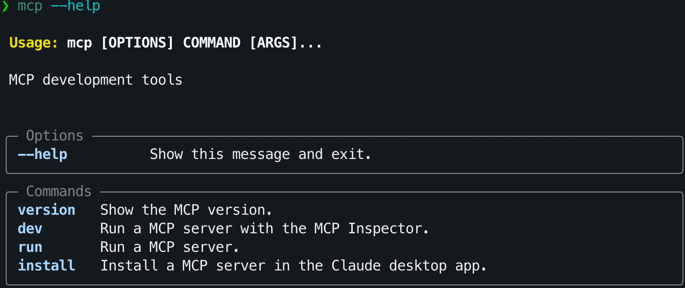
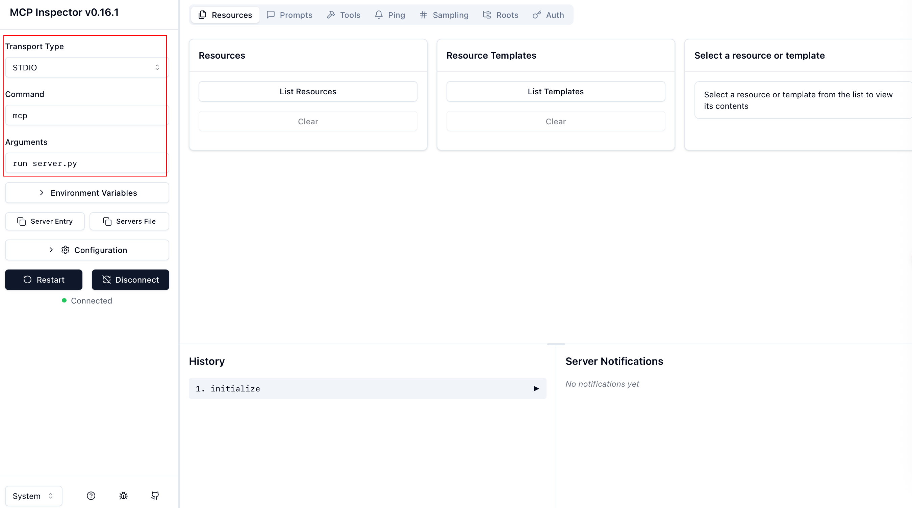
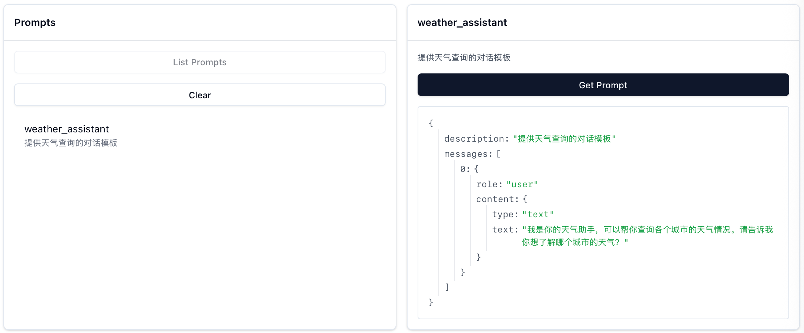
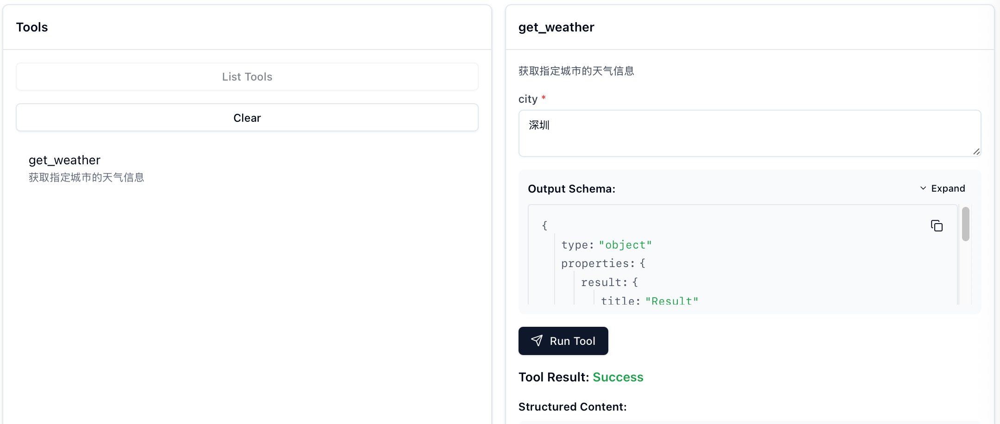
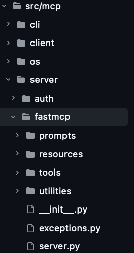

# 深入 FastMCP 源码：认识 tool()、resource() 和 prompt() 装饰器

> 在使用 FastMCP 开发 MCP 服务器时经常会用到 `@mcp.tool()` 等装饰器。虽然它们用起来很简单，但当作黑匣子总让人感觉"不得劲"。接下来我们将深入相关的源码实现，别担心，不会钻没有意义的“[兔子洞](https://en.wikipedia.org/wiki/Wiki_rabbit_hole)”，你可以通过这篇文章了解到：
>
> - 如何简单启动本地的 MCP Server 和 MCP Inspector
> - 这些装饰器具体做了什么
>   - @mcp.tool()
>   - @mcp.resource()
>   - @mcp.prompt()
>
> MCP 官方 Python SDK 地址：[https://github.com/modelcontextprotocol/python-sdk](https://github.com/modelcontextprotocol/python-sdk)。
>
> 需要注意的是，Python>=3.10 才可以安装 MCP，后续的前置文章会更新这一点，包括过去可能过时的所有代码文件版本。
>
> （**写在前面**：说声抱歉，迟到很久的更新。这段时间因为DDL太多，下意识地回避了仓库 & 邮件。计划 8 月会对目前存在的 Issues 和 PR 全部进行处理 & 更新所有文件的 uv 命令 & 并在李宏毅老师的许可下对今年的 Homework 进行跟进。另外 FastMCP() 的初始化讲解会在之后完结。届时会删除这个“Flag” :) ）
>
> **代码文件下载**：[server.py](../Demos/mcp/server.py)，[debug_func_metadata.py](../Demos/mcp/debug_func_metadata.py)

## 目录

- [安装库](#安装库)
- [server.py](#serverpy)
- [什么是 FastMCP？](#什么是-fastmcp)
- [装饰器](#装饰器)
   - [什么是装饰器？](#什么是装饰器)
   - [@mcp.tool()](#mcptool)
     - [追溯源码](#追溯源码)
   - [@mcp.resource()](#mcpresource)
     - [追溯源码](#追溯源码-1)
   - [@mcp.prompt()](#mcpprompt)
     - [追溯源码](#追溯源码-2)
- [附录](#附录)
   - [debug_func_metadata.py](#debug_func_metadatapy)

## 安装库

```bash
pip install mcp
```

## server.py

下面是一个简化的 server.py 示例：

```python
from mcp.server.fastmcp import FastMCP

# 初始化 FastMCP server
mcp = FastMCP(
    name="weather",
    #host="0.0.0.0",
    #port="8234"
)

@mcp.tool()
def get_weather(city: str) -> str:
    """获取指定城市的天气信息"""
    # 简单模拟数据，实际应用中应该调用对应的API
    weather_data = {
        "北京": "晴天，温度 22°C",
        "上海": "多云，温度 25°C", 
        "广州": "小雨，温度 28°C",
        "深圳": "阴天，温度 26°C"
    }
    return weather_data.get(city, f"{city} 的天气数据暂不可用")

@mcp.prompt()
def weather_assistant():
    """提供天气查询的对话模板"""
    return "我是你的天气助手，可以帮你查询各个城市的天气情况。请告诉我你想了解哪个城市的天气？"

@mcp.resource("resource://cities")
def get_cities():
    """返回支持查询天气的城市列表"""
    cities = ["北京", "上海", "广州", "深圳"]
    return f"Cities: {', '.join(cities)}"

@mcp.resource("resource://{city}/weather")
def get_weather(city: str) -> str:
    return f"Weather for {city}"

if __name__ == "__main__":
    mcp.run(transport="stdio")
```

将其保存为 server 后，可以使用以下命令直接进行调试：

```python
mcp dev server.py
# 如果克隆了仓库，可以指定 demos 文件夹下的路径，比如：mcp dev demos/mcp/server.py
```

`mcp dev` 会在运行MCP服务器的同时启动 MCP Inspector：



MCP Inspector 界面配置如下图左框：



配置项（Command + Arguments）实际对应于能够运行服务器的命令，所以并不局限，有很多组合可以使用：

| Command | Arguments                        |
| ------- | -------------------------------- |
| mcp     | run server.py                    |
| python  | server.py                        |
| uv      | run server.py                    |
| uv      | run mcp run server.py            |
| uv      | run --with mcp mcp run server.py |
| uv      | run python server.py             |

最后三行命令实际只是 uv 对前两行命令的封装（uv 可以替代 pip/conda，目前已经被广泛使用）。

连接成功后，你可以在 MCP Inspector 中看到注册的 Resources、Prompts 和 Tools：

| Resources                                                    | Prompts                                                      | Tools                                                        |
| ------------------------------------------------------------ | ------------------------------------------------------------ | ------------------------------------------------------------ |
|  |  |  |

## 什么是 FastMCP？

官方仓库中对应的路径为 [src/mcp/server/fastmcp](https://github.com/modelcontextprotocol/python-sdk/tree/main/src/mcp/server/fastmcp)：



从 `from mcp.server.fastmcp import FastMCP` 开始，既然能够直接 import FastMCP，那先查看 `__init__.py`：

```python
"""FastMCP - 一个更人性化的 MCP 服务器接口。"""

from importlib.metadata import version

from .server import Context, FastMCP
from .utilities.types import Image

__version__ = version("mcp")
__all__ = ["FastMCP", "Context", "Image"]
```

可以看到 FastMCP 是从当前文件夹的 `server.py` 中导入的，所以接下来查看 [server.py](https://github.com/modelcontextprotocol/python-sdk/blob/0b1b52ba45edd5bd3bf4c85e6bf3a8d7baf2766c/src/mcp/server/fastmcp/server.py#L133)（省略部分初始化逻辑）：

```python
class FastMCP:
    def __init__(
        self,
        name: str | None = None,
        instructions: str | None = None,
        auth_server_provider: OAuthAuthorizationServerProvider[Any, Any, Any] | None = None,
        token_verifier: TokenVerifier | None = None,
        event_store: EventStore | None = None,
        *,
        tools: list[Tool] | None = None,
        **settings: Any,
    ):
        ...
        
        self._tool_manager = ToolManager(tools=tools, warn_on_duplicate_tools=self.settings.warn_on_duplicate_tools)
        self._resource_manager = ResourceManager(warn_on_duplicate_resources=self.settings.warn_on_duplicate_resources)
        self._prompt_manager = PromptManager(warn_on_duplicate_prompts=self.settings.warn_on_duplicate_prompts)
        
        ...
```

初始化（`__init__`）的代码中有三个很眼熟的部分：

- `_tool_manager`：管理工具（Tools）
- `_resource_manager`：管理资源（Resources）
- `_prompt_manager`：管理提示词（Prompts）

这三者分别对应于之后要介绍的装饰器。

>  FastMCP 初始化的具体解析不会在本文进行，后续相关文章完结时此行会替换为索引链接。

## 装饰器

### 什么是装饰器？

装饰器可以理解为一个接受函数作为参数，并返回一个新函数的函数。这可以让我们在不修改原函数代码的情况下添加通用的行为，通过一个简单的例子来理解：

```python
def decorator(func):
    """一个简单的装饰器示例"""
    def wrapper(*args, **kwargs):
        print(f"调用函数 {func.__name__} 之前")
        result = func(*args, **kwargs)
        print(f"调用函数 {func.__name__} 之后\n")
        return result
    return wrapper

# 方式1：使用 @ 语法糖
@decorator
def say_hello(name):
    print(f"Hello, {name}!")
say_hello("Xiaoming")

# 方式2：直接调用装饰器函数
def say_hello(name):
    print(f"Hello, {name}!")
say_hello = decorator(say_hello)
say_hello("Xiaoming")
```

**输出**：

```python
调用函数 say_hello 之前
Hello, Xiaoming!
调用函数 say_hello 之后

调用函数 say_hello 之前
Hello, Xiaoming!
调用函数 say_hello 之后
```

在 FastMCP 中，装饰器的工作方式类似，但并不是简单地 print，而是将函数注册到对应的管理器中：

- `@mcp.tool()` - 将函数注册为工具
- `@mcp.resource()` - 将函数注册为资源
- `@mcp.prompt()` - 将函数注册为提示词模板

接下来会着重讲解 tool() 装饰器，resource() 和 prompt() 的处理逻辑基本是 tool() 的简化版本，所以部分逻辑会带过。

> [!note]
>
> 使用 `@mcp.*` 的格式是因为初始化 `mcp=FastMCP()`，如果变量名从 `mcp` 改为了 `server`，即：`server=FastMCP()`，那么装饰器就应该使用 `@server.*` 的格式。

### @mcp.tool()

`@mcp.tool()` 装饰器用于将 Python 函数自动注册为当前 `mcp` 服务器中的工具。摘选之前的片段：

```python
@mcp.tool()
def get_weather(city: str) -> str:
    """获取指定城市的天气信息"""
    # 简单模拟数据，实际应用中应该调用对应的API
    weather_data = {
        "北京": "晴天，温度 22°C",
        "上海": "多云，温度 25°C", 
        "广州": "小雨，温度 28°C",
        "深圳": "阴天，温度 26°C"
    }
    return weather_data.get(city, f"{city} 的天气数据暂不可用")
```

这段代码实际上会：

1. 自动提取函数的参数类型信息（下面的信息由之后的 `debug_func_metadata` 打印）。

   ```json
   函数签名分析:
      完整签名: (city: str) -> str
      返回类型: <class 'str'>
      参数数量: 1
   参数名: city
       原始注解: <class 'str'>
       参数种类: POSITIONAL_OR_KEYWORD
       默认值: <class 'inspect._empty'>
       类型化注解: <class 'str'>
       字段信息: annotation=<class 'str'>, default=PydanticUndefined
   ```

2. 生成参数的 JSON Schema（函数名+Arguments）。

   ```json
   🏗️  创建 Pydantic 模型:
      模型名称: get_weatherArguments
      基类: <class 'mcp.server.fastmcp.utilities.func_metadata.ArgModelBase'>
      ✅ 模型创建成功: <class '__main__.get_weatherArguments'>
   
   get_weatherArguments JSON Schema:
   {
     "properties": {
       "city": {
         "title": "City",
         "type": "string"
       }
     },
     "required": [
       "city"
     ],
     "title": "get_weatherArguments",
     "type": "object"
   }
   ```

3. 将函数注册为 MCP 工具（`self._tools[tool.name] = tool`）。

另外，`mcp.tool()` 可以接受以下参数（此处参数解释参考 [tool](https://github.com/modelcontextprotocol/python-sdk/blob/6a84a2f79f4feaca59461f3c879d7482c6d85dec/src/mcp/server/fastmcp/server.py#L351) 和 [func_metadata](https://github.com/modelcontextprotocol/python-sdk/blob/6a84a2f79f4feaca59461f3c879d7482c6d85dec/src/mcp/server/fastmcp/utilities/func_metadata.py#L166)）：

- **name**: 可选的工具名称，默认为函数名

- **title**: 可选的工具标题（用于人类阅读）

- **description**: 可选的工具功能描述，默认使用函数的文档字符串

- **annotations**: 可选的 ToolAnnotations，提供额外的工具信息

- **structured_output**：控制工具输出是结构化还是非结构化的

  - `None`: 基于函数的返回类型注解自动检测

  - `True`: 无条件创建结构化工具（在返回类型注解允许的情况下）

    如果是结构化，会根据函数的返回类型注释创建 Pydantic 模型。支持各种返回类型：

    - BaseModel 子类（直接使用）
    - 原始类型（str、int、float、bool、bytes、None）- 包装在带有 'result' 字段的模型中
    - TypedDict - 转换为具有相同字段的 Pydantic 模型
    - 数据类和其他带注释的类 - 转换为 Pydantic 模型
    - 泛型类型（list、dict、Union 等）- 包装在带有 'result' 字段的模型中

  - `False`: 无条件创建非结构化工具

> [!note]
>
> 如果你只想了解如何使用 `@mcp.tool()`，可以跳过下面的源码部分。

#### 追溯源码

```python
class FastMCP:
    ...
    def tool(
            self,
            name: str | None = None,
            title: str | None = None,
            description: str | None = None,
            annotations: ToolAnnotations | None = None,
            structured_output: bool | None = None,
        ) -> Callable[[AnyFunction], AnyFunction]:
        """用于注册工具的装饰器。
    
        工具可以通过添加 Context 类型注解的参数来可选地请求一个 Context 对象。
        Context 提供对 MCP 功能的访问，包括日志记录、进度报告和资源访问。
        """
        # 检查装饰器是否被正确使用（需要带括号调用）
        if callable(name):
            raise TypeError(
                "The @tool decorator was used incorrectly. Did you forget to call it? Use @tool() instead of @tool"
            )

        def decorator(fn: AnyFunction) -> AnyFunction:
            self.add_tool(
                fn,
                name=name,
                title=title,
                description=description,
                annotations=annotations,
                structured_output=structured_output,
            )
            return fn

        return decorator
```

这里的 `self.add_tool()` 就是 `mcp.add_tool()`，所以也可以不使用装饰器达到一样的目的：

```python
def get_weather():
    pass
    
mcp = FastMCP(name="weather")
mcp.add_tool(get_weather)  # 和 get_weather 使用@mcp.tool()效果一样
```

这一行为最终调用的是` self._tool_manager.add_tool()`，`self._tool_manager` 在`__init__()` 中对应的是 `tools/tool_manager.py` 中的 `ToolManager` 类：

```python
class ToolManager:
    """管理 FastMCP 工具."""

    def __init__(
        self,
        warn_on_duplicate_tools: bool = True,
        *,
        tools: list[Tool] | None = None,
    ):
        self._tools: dict[str, Tool] = {}
        if tools is not None:
            for tool in tools:
                if warn_on_duplicate_tools and tool.name in self._tools:
                    logger.warning(f"Tool already exists: {tool.name}")
                self._tools[tool.name] = tool

        self.warn_on_duplicate_tools = warn_on_duplicate_tools

    def add_tool(
        self,
        fn: Callable[..., Any],
        name: str | None = None,
        title: str | None = None,
        description: str | None = None,
        annotations: ToolAnnotations | None = None,
        structured_output: bool | None = None,
    ) -> Tool:
        """添加 tool 到 server。"""
        tool = Tool.from_function(
            fn,
            name=name,
            title=title,
            description=description,
            annotations=annotations,
            structured_output=structured_output,
        )
        existing = self._tools.get(tool.name)
        if existing:
            if self.warn_on_duplicate_tools:
                logger.warning(f"Tool already exists: {tool.name}")
            return existing
        self._tools[tool.name] = tool
        return tool
```

我们不需要关注 ToolManager 是怎么进行管理的，这不重要，重要的是装饰器怎么处理我们自定义的函数。

整个 `@mcp.tool()` 装饰器的工作按执行顺序可以拆分为：

1. **装饰器检查调用方式是否正确（必须带括号），然后将被装饰的函数传递给 `ToolManager.add_tool()`**。

   ```python
   class FastMCP:
       ...
       def tool(self, name, ...):
           if callable(name):
               raise TypeError(
                   "The @tool decorator was used incorrectly. Did you forget to call it? Use @tool() instead of @tool"
               )
           def decorator(fn: AnyFunction) -> AnyFunction:
                   self.add_tool(
                       fn,  # 被装饰的函数
                       name=name,
                       title=title,
                       description=description,
                       annotations=annotations,
                       structured_output=structured_output,
                   )
                   return fn
   
               return decorator
   ```

2. **`Tool.from_function()` 处理函数元数据**。

   ```python
   class ToolManager:
       ...
       def add_tool(self, ...):
           tool = Tool.from_function(
                   fn,  # 被装饰的函数
                   name=name,
                   title=title,
                   description=description,
                   annotations=annotations,
                   structured_output=structured_output,
               )
       ...
   ```

   > [!note]
   >
   > `tool = Tool.from_function(...)` 是当前最重要的处理部分，对应代码位于 [tools/base.py](https://github.com/modelcontextprotocol/python-sdk/blob/0b1b52ba45edd5bd3bf4c85e6bf3a8d7baf2766c/src/mcp/server/fastmcp/tools/base.py#L21)，其主要步骤如下（代码按顺序拼接等价于 [Tool.from_function()](https://github.com/modelcontextprotocol/python-sdk/blob/0b1b52ba45edd5bd3bf4c85e6bf3a8d7baf2766c/src/mcp/server/fastmcp/tools/base.py#L41)，出于讲解目的将其进行了拆分）：
   >
   > **a. 解析函数签名，提取参数信息**。
   >
   > ```python
   > class Tool(BaseModel):
   >     ...
   >     @classmethod
   >     def from_function(
   >         cls,  # 这里的 cls 就是 Tool 类本身，不是实例
   >         fn: Callable[..., Any],
   >         name: str | None = None,
   >         title: str | None = None,
   >         description: str | None = None,
   >         context_kwarg: str | None = None,
   >         annotations: ToolAnnotations | None = None,
   >         structured_output: bool | None = None,
   >     ) -> Tool:
   >         """从函数创建工具."""
   >         from mcp.server.fastmcp.server import Context
   > 
   >         func_name = name or fn.__name__
   > 
   >         # Lambda 函数必须提供 name 参数
   >         if func_name == "<lambda>":
   >             raise ValueError("You must provide a name for lambda functions")
   > 
   >         # 如果没有传入 description，则使用函数的文档字符串
   >         func_doc = description or fn.__doc__ or ""
   >         is_async = _is_async_callable(fn)
   >     	...
   > ```
   >
   > **b. 自动检测 Context 参数**， `inspect.signature()` 会遍历函数的所有参数，检查参数类型是否为 [Context](https://github.com/modelcontextprotocol/python-sdk/blob/6a84a2f79f4feaca59461f3c879d7482c6d85dec/src/mcp/server/fastmcp/server.py#L985) 的子类，如果是的话会记录为 `context_kwarg`，这个参数会被传入 `func_metadata()` 的 `skip_names`（可以跳过这一步的理解，等真正涉及到的时候再探究），不会出现在工具对应的 JSON Schema 中。
   >
   > ```python
   >  class Tool(BaseModel):
   >     ...
   >     @classmethod
   >     def from_function(...):
   >         ...
   >         # 自动检测 Context 参数
   >         if context_kwarg is None:
   >             sig = inspect.signature(fn)
   >             for param_name, param in sig.parameters.items():
   >                 # 跳过泛型类型
   >                 if get_origin(param.annotation) is not None:
   >                     continue
   >                 # 检查参数类型是否是 Context 的子类
   >                 if issubclass(param.annotation, Context):
   >                     context_kwarg = param_name
   >                     break
   > ```
   >
   > **c. 生成参数的 JSON Schema**：
   >
   > ```python
   >  class Tool(BaseModel):
   >     ...
   >    @classmethod
   >     def from_function(...):
   >         ...
   >         # 生成函数元数据，包括参数的 JSON Schema
   >         func_arg_metadata = func_metadata(
   >             fn,
   >             skip_names=[context_kwarg] if context_kwarg is not None else [],
   >             structured_output=structured_output,
   >         )
   >         # 从 Pydantic 模型生成 JSON Schema
   >         parameters = func_arg_metadata.arg_model.model_json_schema(by_alias=True)
   > ```
   >
   > `func_metadata` 相关源代码位于 [utilities/func_metadata.py](https://github.com/modelcontextprotocol/python-sdk/blob/0b1b52ba45edd5bd3bf4c85e6bf3a8d7baf2766c/src/mcp/server/fastmcp/utilities/func_metadata.py#L166)，这里我们进行主体逻辑的抽取打印（完整 debug_func_metadata 函数见[附录](#附录)）：
   >
   > ```python
   > def func(
   >        data,  # 无类型注解
   >     format: str = "json",  # 有注解+默认值
   >    count: Optional[int] = None,  # 复杂类型+默认值
   >     validate: bool = True  # 基础类型+默认值
   >):  # 无返回类型注解'
   > 	"""展示各种注解情况"""
   >     return data
   > 
   > debug_func_metadata(func, skip_names="count")
   > ```
   > 
   > **输出**：
   >    
   >    ```json
   >    ============================================================
   >    🔍 开始解析函数: func
   >       文档字符串: 展示各种注解情况
   >    ============================================================
   >    
   >    📋 函数签名分析:
   >     完整签名: (data, format: str = 'json', count: Optional[int] = None, validate: bool = True)
   >     返回类型: <class 'inspect._empty'>
   >     参数数量: 4
   >  
   >    🔧 参数处理详情:
   >       跳过的参数名: ['c', 'o', 'u', 'n', 't']
   >    
   >       [1] 参数名: data
   >            原始注解: <class 'inspect._empty'>
   >            参数种类: POSITIONAL_OR_KEYWORD
   >            默认值: <class 'inspect._empty'>
   >            ⚠️  处理: 无类型注解，默认为 Any
   >          🔄 类型化注解: typing.Annotated[typing.Any, FieldInfo(annotation=NoneType, required=True), WithJsonSchema(json_schema={'title': 'data', 'type': 'string'}, mode=None)]
   >            ✅ 字段信息: annotation=typing.Any, default=PydanticUndefined
   >    
   >       [2] 参数名: format
   >            原始注解: <class 'str'>
   >            参数种类: POSITIONAL_OR_KEYWORD
   >            默认值: json
   >            🔄 类型化注解: <class 'str'>
   >            ✅ 字段信息: annotation=<class 'str'>, default=json
   >    
   >       [3] 参数名: count
   >            原始注解: typing.Optional[int]
   >            参数种类: POSITIONAL_OR_KEYWORD
   >            默认值: None
   >          ⏭️  跳过此参数
   >    
   >       [4] 参数名: validate
   >            原始注解: <class 'bool'>
   >            参数种类: POSITIONAL_OR_KEYWORD
   >            默认值: True
   >          🔄 类型化注解: <class 'bool'>
   >            ✅ 字段信息: annotation=<class 'bool'>, default=True
   >            ⚠️  冲突处理: 参数名 'validate' 与 BaseModel 方法冲突
   >                -> 使用内部名称: field_validate
   >    
   >    📊 参数处理总结:
   >       总参数数: 4
   >       处理参数数: 3
   >       模型字段: ['data', 'format', 'field_validate']
   >    
   >    🏗️  创建 Pydantic 模型:
   >       模型名称: funcArguments
   >    基类: <class 'mcp.server.fastmcp.utilities.func_metadata.ArgModelBase'>
   >       ✅ 模型创建成功: <class '__main__.funcArguments'>
   >    
   >    📄 funcArguments JSON Schema:
   >    {
   >      "properties": {
   >        "data": {
   >          "title": "data",
   >          "type": "string"
   >        },
   >        "format": {
   >          "default": "json",
   >          "title": "Format",
   >          "type": "string"
   >        },
   >        "validate": {
   >          "default": true,
   >          "title": "Validate",
   >          "type": "boolean"
   >        }
   >   },
   >      "required": [
   >        "data"
   >      ],
   >      "title": "funcArguments",
   >      "type": "object"
   >    }
   >    
   >    🎯 返回值处理:
   >       structured_output 参数: None
   >       返回注解: <class 'inspect._empty'>
   >          经过_get_typed_annotation处理后的类型: <class 'inspect._empty'>
   >          ℹ️  未创建输出模型
   >          wrap_output: False
   >    
   >    ✨ func_metadata 处理完成!
   >       最终结果: arg_model=<class '__main__.funcArguments'> output_schema=None output_model=None wrap_output=False
   >    ============================================================
   >    ```
   >    
   >    **d. 创建 Tool 实例（`Tool.from_function` 的 `return cls(...)`）**。
   >    
   >    ```python
   >    class Tool(BaseModel):
   >     ...
   >     @classmethod
   >     def from_function(...):
   >            return cls( # 使用 cls() 创建 Tool 实例，等价于 Tool()
   >              fn=fn,
   >             name=func_name,
   >             title=title,
   >              description=func_doc,
   >             parameters=parameters,
   >              fn_metadata=func_arg_metadata,
   >              is_async=is_async,
   >                 context_kwarg=context_kwarg,
   >                 annotations=annotations,
   >             )
   >    ```
   
3. **将Tool 实例注册到工具管理器中**。

   ```python
   class ToolManager:
       ...
       def add_tool(...) -> Tool:
           """添加 tool 到 server。"""
           tool = Tool.from_function(...)
           existing = self._tools.get(tool.name)
           if existing:
               if self.warn_on_duplicate_tools:
                   logger.warning(f"Tool already exists: {tool.name}")
               return existing
           self._tools[tool.name] = tool
           return tool
   ```

### @mcp.resource()

`@mcp.resource()` 装饰器用于定义可供访问的资源，需要注意的是：

- **必须**提供一个资源 URI（如 `@mcp.resource("resource://cities")`）

- 资源可以是静态的（每次调用返回相同内容）或动态的（根据参数填充内容）。

  - 静态对应于 MCP Inspector 中的 `Resources`，动态对应于 `Resources Templates`，以下面两个资源为例进行展示：

    ```python
    from mcp.server.fastmcp import FastMCP
    
    # 初始化 FastMCP server
    mcp = FastMCP("cities")
    
    @mcp.resource("resource://cities")
    def get_cities():
        """返回支持查询天气的城市列表"""
        cities = ["北京", "上海", "广州", "深圳"]
        return f"Cities: {', '.join(cities)}"
    
    @mcp.resource("resource://{city}/weather")
    def get_weather(city: str) -> str:
        return f"Weather for {city}"
    
    if __name__ == "__main__":
        mcp.run(transport="stdio")
    ```
    
    此时 MCP Inspector 的 Resources 模块显示如下：
    
    

#### 追溯源码

查看 [server.py](https://github.com/modelcontextprotocol/python-sdk/blob/c260e29a92c38f760985a57fadd64110d2a31d3d/src/mcp/server/fastmcp/server.py#L435) 中的 `resource` 方法：

```python
class FastMCP:
    ...
	def resource(
        self,
        uri: str,
        *,
        name: str | None = None,
        title: str | None = None,
        description: str | None = None,
        mime_type: str | None = None,
    ) -> Callable[[AnyFunction], AnyFunction]:
        """用于将函数注册为资源的装饰器。
    
        当资源被读取时，将调用被装饰的函数来动态生成资源内容。

        函数可以返回：
        - str: 文本内容
        - bytes: 二进制内容  
        - 其他类型: 将自动转换为 JSON 格式

        如果 URI 包含参数占位符（如 "resource://{param}"）或者函数本身有参数，
        该资源将被注册为模板资源。

        参数：
            uri: 资源的 URI（如 "resource://my-resource" 或 "resource://{param}"）
            name: 可选的资源名称
            title: 可选的资源标题（用于人类阅读）
            description: 可选的资源描述
            mime_type: 可选的 MIME 类型

        使用示例：
            # 静态资源
            @server.resource("resource://my-resource")
            def get_data() -> str:
                return "Hello, world!"

            # 参数化模板资源
            @server.resource("resource://{city}/weather")
            def get_weather(city: str) -> str:
                return f"Weather for {city}"
        """
        # 检查装饰器是否被正确使用（需要带括号调用）
        if callable(uri):
            raise TypeError(
                "The @resource decorator was used incorrectly. Did you forget to call it? Use @resource('uri') instead of @resource"
            )

        def decorator(fn: AnyFunction) -> AnyFunction:
            # 通过 URI 中的 "{}" 和函数自身的参数来检查是否是模版
            has_uri_params = "{" in uri and "}" in uri
            has_func_params = bool(inspect.signature(fn).parameters)

            if has_uri_params or has_func_params:
                # （有参数）提取 URI 参数和函数参数
                uri_params = set(re.findall(r"{(\w+)}", uri))
                func_params = set(inspect.signature(fn).parameters.keys())
				# 验证 URI 参数和函数参数是否匹配
                if uri_params != func_params:
                    raise ValueError(
                        f"Mismatch between URI parameters {uri_params} and function parameters {func_params}"
                    )

                # 注册为模板资源，调用 _resource_manager.add_template()
                self._resource_manager.add_template(
                    fn=fn,
                    uri_template=uri,
                    name=name,
                    title=title,
                    description=description,
                    mime_type=mime_type,
                )
            else:
                # （无参数）注册为普通资源
                resource = FunctionResource.from_function(
                    fn=fn,
                    uri=uri,
                    name=name,
                    title=title,
                    description=description,
                    mime_type=mime_type,
                )
                self.add_resource(resource)  # 调用 self._resource_manager.add_resource(resource)
            return fn

        return decorator
```

`ResourceManager` 的实现位于 [resources/resource_manager.py](https://github.com/modelcontextprotocol/python-sdk/blob/main/src/mcp/server/fastmcp/resources/resource_manager.py)：

```python
class ResourceManager:
    """管理 FastMCP 资源。"""

    def __init__(self, warn_on_duplicate_resources: bool = True):
        self._resources: dict[str, Resource] = {}
        self._templates: dict[str, ResourceTemplate] = {}
        self.warn_on_duplicate_resources = warn_on_duplicate_resources

    def add_resource(self, resource: Resource) -> Resource:
        """向管理器中添加资源。
        
        参数：
            resource: 要添加的 Resource 实例
            
        返回：
            当前添加的资源。如果具有相同 URI 的资源已存在，则返回现有的资源。
        """
        logger.debug(
            "Adding resource",
            extra={
                "uri": resource.uri,
                "type": type(resource).__name__,
                "resource_name": resource.name,
            },
        )
        existing = self._resources.get(str(resource.uri))
        if existing:
            if self.warn_on_duplicate_resources:
                logger.warning(f"Resource already exists: {resource.uri}")
            return existing
        self._resources[str(resource.uri)] = resource
        return resource

    def add_template(
        self,
        fn: Callable[..., Any],
        uri_template: str,
        name: str | None = None,
        title: str | None = None,
        description: str | None = None,
        mime_type: str | None = None,
    ) -> ResourceTemplate:
        """根据函数添加模版。"""
        template = ResourceTemplate.from_function(
            fn,
            uri_template=uri_template,
            name=name,
            title=title,
            description=description,
            mime_type=mime_type,
        )
        self._templates[template.uri_template] = template
        return template
    ...
```

对于静态资源，`add_resource` 方法会直接将 `FunctionResource` 实例存储在 `_resources` 字典中。对于动态资源，`add_template` 方法会创建 `ResourceTemplate` 实例并存储在 `_templates` 字典中。

1. **静态**：`FunctionResource` 位于 [resources/types.py](https://github.com/modelcontextprotocol/python-sdk/blob/main/src/mcp/server/fastmcp/resources/types.py)：

   ```python
   class FunctionResource(Resource):
       """通过包装函数来延迟加载数据的资源。
   
       函数只有在资源被读取时才会被调用，允许对可能昂贵的数据进行延迟加载。
       这在列出资源时特别有用，因为函数不会被调用，直到资源被实际访问。
   
       函数可以返回：
       - str 表示文本内容（默认）
       - bytes 表示二进制内容
       - 其他类型将被转换为 JSON
       """
   
       fn: Callable[[], Any] = Field(exclude=True)
   
       ...
       @classmethod
       def from_function(
           cls,
           fn: Callable[..., Any],
           uri: str,
           name: str | None = None,
           title: str | None = None,
           description: str | None = None,
           mime_type: str | None = None,
       ) -> "FunctionResource":
           """从函数创建 FunctionResource。"""
           func_name = name or fn.__name__
           if func_name == "<lambda>":
               raise ValueError("You must provide a name for lambda functions")
   
           # 确保参数被正确转换
           fn = validate_call(fn)
   
           return cls(
               uri=AnyUrl(uri),
               name=func_name,
               title=title,
               description=description or fn.__doc__ or "",
               mime_type=mime_type or "text/plain",
               fn=fn,
           )
   ```
   
2. **动态**：`ResourceTemplate` 位于 [resources/templates.py](https://github.com/modelcontextprotocol/python-sdk/blob/main/src/mcp/server/fastmcp/resources/templates.py)：

   ```python
   class ResourceTemplate(BaseModel):
       """动态创建资源的模板。"""
   
       uri_template: str = Field(description="URI template with parameters (e.g. weather://{city}/current)")
       name: str = Field(description="Name of the resource")
       title: str | None = Field(description="Human-readable title of the resource", default=None)
       description: str | None = Field(description="Description of what the resource does")
       mime_type: str = Field(default="text/plain", description="MIME type of the resource content")
       fn: Callable[..., Any] = Field(exclude=True)
       parameters: dict[str, Any] = Field(description="JSON schema for function parameters")
   
       @classmethod
       def from_function(
           cls,
           fn: Callable[..., Any],
           uri_template: str,
           name: str | None = None,
           title: str | None = None,
           description: str | None = None,
           mime_type: str | None = None,
       ) -> ResourceTemplate:
           """从函数创建模板。"""
           func_name = name or fn.__name__
           if func_name == "<lambda>":
               raise ValueError("You must provide a name for lambda functions")
   
           # 从 TypeAdapter 获取 schema - 如果函数没有正确的类型注解会失败
           parameters = TypeAdapter(fn).json_schema()
   
           # 确保参数被正确转换
           fn = validate_call(fn)
   
           return cls(
               uri_template=uri_template,
               name=func_name,
               title=title,
               description=description or fn.__doc__ or "",
               mime_type=mime_type or "text/plain",
               fn=fn,
               parameters=parameters,
           )
   ```


### @mcp.prompt()

`@mcp.prompt()` 装饰器用于定义提示词模板，这部分的实现只是简单维护了一个字典。

#### 追溯源码

查看 [server.py](https://github.com/modelcontextprotocol/python-sdk/blob/c260e29a92c38f760985a57fadd64110d2a31d3d/src/mcp/server/fastmcp/server.py#L535) 中的 `prompt` 方法：

```python
class FastMCP:
    ...
    def prompt(
        self,
        name: str | None = None,
        title: str | None = None,
        description: str | None = None,
        annotations: PromptAnnotations | None = None,
    ) -> Callable[[AnyFunction], AnyFunction]:
        """注册提示词的装饰器。

        参数：
            name: 可选的提示词名称（默认使用函数名）
            title: 可选的提示词人类可读标题
            description: 可选的提示词功能描述

        使用示例：
            @server.prompt()
            def analyze_table(table_name: str) -> list[Message]:
                schema = read_table_schema(table_name)
                return [
                    {
                        "role": "user",
                        "content": f"Analyze this schema:\n{schema}"
                    }
                ]

            @server.prompt()
            async def analyze_file(path: str) -> list[Message]:
                content = await read_file(path)
                return [
                    {
                        "role": "user",
                        "content": {
                            "type": "resource",
                            "resource": {
                                "uri": f"file://{path}",
                                "text": content
                            }
                        }
                    }
                ]
        """
        # 同样的验证逻辑
        if callable(name):
            raise TypeError(
                "The @prompt decorator was used incorrectly. Did you forget to call it? Use @prompt() instead of @prompt"
            )

        def decorator(func: AnyFunction) -> AnyFunction:
            prompt = Prompt.from_function(
                func,
                name=name,
                title=title,
                description=description
            )
            self.add_prompt(prompt)  # 调用 self._prompt_manager.add_prompt(prompt)
            return func

        return decorator
```

`PromptManager` 的实现位于 [prompts/prompt_manager.py](https://github.com/modelcontextprotocol/python-sdk/blob/main/src/mcp/server/fastmcp/prompts/prompt_manager.py)：

```python
class PromptManager:
    """管理 FastMCP 提示词。"""
    
    def __init__(self, warn_on_duplicate_prompts: bool = True):
        self._prompts: dict[str, Prompt] = {}
        self.warn_on_duplicate_prompts = warn_on_duplicate_prompts
        
    def add_prompt(self, prompt: Prompt) -> Prompt:
        """添加提示词到管理器。"""
        logger.debug(f"Adding prompt: {prompt.name}")
        existing = self._prompts.get(prompt.name)
        if existing:
            if self.warn_on_duplicate_prompts:
                logger.warning(f"Prompt already exists: {prompt.name}")
            return existing
        self._prompts[prompt.name] = prompt
        return prompt

    def get_prompt(self, name: str) -> Prompt | None:
        """根据名称获取提示词。"""
        return self._prompts.get(name)

    def list_prompts(self) -> list[Prompt]:
        """列出所有已注册的提示词。"""
        return list(self._prompts.values())
```

## 附录

### debug_func_metadata.py

> 官方源码：[utilities/func_metadata.py](https://github.com/modelcontextprotocol/python-sdk/blob/0b1b52ba45edd5bd3bf4c85e6bf3a8d7baf2766c/src/mcp/server/fastmcp/utilities/func_metadata.py#L166)
>
> **调试文件下载**：[debug_func_metadata.py](../Demos/debug_func_metadata.py)

```python
#!/usr/bin/env python3
"""
func_metadata 调试工具，可以保存为 debug_func_metadata.py 执行
"""

import inspect
import json
from typing import Any, Callable, Sequence, Optional, List, Dict
from pydantic import BaseModel, Field, create_model
from pydantic.fields import FieldInfo
from typing_extensions import Annotated

from mcp.server.fastmcp.utilities.func_metadata import (
    FuncMetadata, 
    ArgModelBase,
    _get_typed_signature,
    _get_typed_annotation,
    _try_create_model_and_schema,
    InvalidSignature,
    PydanticUndefined,
    WithJsonSchema
)


def print_json(data, title="JSON数据"):
    """打印JSON数据"""
    try:
        print(f"\n📄 {title}:")
        print(json.dumps(data, indent=2, ensure_ascii=False))
    except Exception as e:
        print(f"❌ JSON打印失败: {e}")
        print(f"原始数据类型: {type(data)}")
        print(f"原始数据: {data}")


def debug_func_metadata(
    func: Callable[..., Any],
    skip_names: Sequence[str] = (),
    structured_output: bool | None = None,
) -> Any:
    """
    调试版本的 func_metadata 实现，会用到一些 from_function 中的逻辑，比如：func.__name__，func.__doc__ ...
    """
    print(f"\n{'='*60}")
    print(f"🔍 开始解析函数: {func.__name__}")
    print(f"   文档字符串: {func.__doc__}")
    print(f"{'='*60}")

    try:
        # 从这里开始 func_metadata()
        # 步骤1: 获取函数签名
        sig = _get_typed_signature(func)
        params = sig.parameters

        print(f"\n📋 函数签名分析:")
        print(f"   完整签名: {sig}")
        print(f"   返回类型: {sig.return_annotation}")
        print(f"   参数数量: {len(params)}")

        # 准备构建动态 Pydantic 模型的参数字典
        dynamic_pydantic_model_params: dict[str, Any] = {}
        globalns = getattr(func, "__globals__", {})

        print(f"\n🔧 参数处理详情:")
        print(f"   跳过的参数名: {list(skip_names)}")

        # 步骤2: 遍历每个参数
        processed_count = 0
        for idx, param in enumerate(params.values()):
            print(f"\n   [{idx+1}] 参数名: {param.name}")
            print(f"        原始注解: {param.annotation}")
            print(f"        参数种类: {param.kind}")
            print(f"        默认值: {param.default}")

            # 验证参数名
            if param.name.startswith("_"):
                print(f"        ❌ 错误: 参数名不能以 '_' 开头")
                raise InvalidSignature(f"{func.__name__} 的参数 {param.name} 不能以 '_' 开头")

            if param.name in skip_names:
                print(f"        ⏭️  跳过此参数")
                continue

            processed_count += 1
            annotation = param.annotation

            # 处理 `x: None` 或 `x: None = None` 的情况
            if annotation is None:
                print(f"        📝 处理: 类型为 None，添加默认值字段")
                annotation = Annotated[
                    None,
                    Field(default=param.default if param.default is not inspect.Parameter.empty else PydanticUndefined),
                ]

            if annotation is inspect.Parameter.empty:
                print(f"        ⚠️  处理: 无类型注解，默认为 Any")
                annotation = Annotated[
                    Any,
                    Field(),
                    # 🤷 默认将无类型参数视为字符串
                    WithJsonSchema({"title": param.name, "type": "string"}),
                ]

            # 获取类型化注解
            typed_annotation = _get_typed_annotation(annotation, globalns)
            print(f"        🔄 类型化注解: {typed_annotation}")

            # 创建字段信息
            field_info = FieldInfo.from_annotated_attribute(
                typed_annotation,
                param.default if param.default is not inspect.Parameter.empty else PydanticUndefined,
            )

            print(f"        ✅ 字段信息: annotation={field_info.annotation}, default={field_info.default}")

            # 处理参数名与 BaseModel 内置方法冲突的情况，这是必要的，因为 Pydantic 会因此发出警告
            # 例如：'dict' 或 'json' 等
            if hasattr(BaseModel, param.name) and callable(getattr(BaseModel, param.name)):
                print(f"        ⚠️  冲突处理: 参数名 '{param.name}' 与 BaseModel 方法冲突")
                # 使用别名机制避免警告
                field_info.alias = param.name
                field_info.validation_alias = param.name
                field_info.serialization_alias = param.name
                # 内部使用带前缀的参数名
                internal_name = f"field_{param.name}"
                dynamic_pydantic_model_params[internal_name] = (field_info.annotation, field_info)
                print(f"            -> 使用内部名称: {internal_name}")
            else:
                dynamic_pydantic_model_params[param.name] = (field_info.annotation, field_info)

        print(f"\n📊 参数处理总结:")
        print(f"   总参数数: {len(params)}")
        print(f"   处理参数数: {processed_count}")
        print(f"   模型字段: {list(dynamic_pydantic_model_params.keys())}")

        # 步骤3: 动态创建一个 Pydantic 模型来表示函数参数
        arguments_model_name = f"{func.__name__}Arguments"
        print(f"\n🏗️  创建 Pydantic 模型:")
        print(f"   模型名称: {arguments_model_name}")
        print(f"   基类: {ArgModelBase}")

        arguments_model = create_model(
            arguments_model_name,
            **dynamic_pydantic_model_params,
            __base__=ArgModelBase,
        )

        print(f"   ✅ 模型创建成功: {arguments_model}")

        # 生成并打印 JSON Schema
        try:
            # 这部分对应于 func_metadata() 之后的那行代码，提前进行查看
            schema = arguments_model.model_json_schema(by_alias=True)
            print_json(schema, f"{arguments_model_name} JSON Schema")
        except Exception as e:
            print(f"❌ Schema 生成失败: {e}")

        # 步骤4: 处理返回值（完全按照原版本逻辑）
        print(f"\n🎯 返回值处理:")
        print(f"   structured_output 参数: {structured_output}")
        print(f"   返回注解: {sig.return_annotation}")

        if structured_output is False:
            print(f"   🔚 明确不需要结构化输出")
            result = FuncMetadata(arg_model=arguments_model)
            print(f"   ✅ 返回元数据: {result}")
            return result

        # 基于返回类型注释设置结构化输出支持
        if sig.return_annotation is inspect.Parameter.empty and structured_output is True:
            print(f"   ❌ 错误: 要求结构化输出但无返回注解")
            raise InvalidSignature(f"函数 {func.__name__}: 结构化输出需要返回注释")

        output_info = FieldInfo.from_annotation(_get_typed_annotation(sig.return_annotation, globalns))
        annotation = output_info.annotation

        print(f"      经过_get_typed_annotation处理后的类型: {annotation}")

        output_model, output_schema, wrap_output = _try_create_model_and_schema(
            annotation, func.__name__, output_info
        )

        if output_model:
            print(f"      ✅ 输出模型创建成功: {output_model}")
            if output_schema:
                print_json(output_schema, "返回值 JSON Schema")
        else:
            print(f"      ℹ️  未创建输出模型")

        print(f"      wrap_output: {wrap_output}")

        # 模型创建失败或产生警告 - 无结构化输出
        if output_model is None and structured_output is True:
            print(f"      ❌ 结构化输出失败: 返回类型不可序列化")
            raise InvalidSignature(
                f"函数 {func.__name__}: 返回类型 {annotation} 不支持结构化输出"
            )

        # 创建最终结果
        result = FuncMetadata(
            arg_model=arguments_model,
            output_schema=output_schema,
            output_model=output_model,
            wrap_output=wrap_output,
        )

        print(f"\n✨ func_metadata 处理完成!")
        print(f"   最终结果: {result}")
        print(f"{'='*60}\n")

        return result

    except Exception as e:
        print(f"❌ 处理过程中出错: {e}")
        import traceback
        print(f"详细错误信息:\n{traceback.format_exc()}")
        return None


def test():
    """测试各种类型的函数"""
    # 混合注解
    print("\n\n📌 测试1: 混合类型注解")
    def func(
        data,  # 无类型注解
        format: str = "json",  # 有注解+默认值
        count: Optional[int] = None,  # 复杂类型+默认值
        validate: bool = True  # 基础类型+默认值
    ):  # 无返回类型注解
        """展示各种注解情况"""
        return data

    debug_func_metadata(func, skip_names="count")

    # 前缀参数测试
    print("\n\n📌 测试2: 前缀参数冲突")
    def prefix_func(_private: str, field_test: int) -> str:
        """前缀参数"""
        return "test"
    debug_func_metadata(prefix_func)

    print("\n\n📌 测试3: 结构化输出对比")
    def add(a: int, b: int) -> str:
        return a + b
    print("📌 无结构化")
    debug_func_metadata(add, structured_output=False)
    print("\n\n📌 结构化")
    debug_func_metadata(add, structured_output=True)


if __name__ == "__main__":
    test()
```

**输出**：

```json


📌 测试1: 混合类型注解

============================================================
🔍 开始解析函数: func
   文档字符串: 展示各种注解情况
============================================================

📋 函数签名分析:
   完整签名: (data, format: str = 'json', count: Optional[int] = None, validate: bool = True)
   返回类型: <class 'inspect._empty'>
   参数数量: 4

🔧 参数处理详情:
   跳过的参数名: ['c', 'o', 'u', 'n', 't']

   [1] 参数名: data
        原始注解: <class 'inspect._empty'>
        参数种类: POSITIONAL_OR_KEYWORD
        默认值: <class 'inspect._empty'>
        ⚠️  处理: 无类型注解，默认为 Any
        🔄 类型化注解: typing.Annotated[typing.Any, FieldInfo(annotation=NoneType, required=True), WithJsonSchema(json_schema={'title': 'data', 'type': 'string'}, mode=None)]
        ✅ 字段信息: annotation=typing.Any, default=PydanticUndefined

   [2] 参数名: format
        原始注解: <class 'str'>
        参数种类: POSITIONAL_OR_KEYWORD
        默认值: json
        🔄 类型化注解: <class 'str'>
        ✅ 字段信息: annotation=<class 'str'>, default=json

   [3] 参数名: count
        原始注解: typing.Optional[int]
        参数种类: POSITIONAL_OR_KEYWORD
        默认值: None
        ⏭️  跳过此参数

   [4] 参数名: validate
        原始注解: <class 'bool'>
        参数种类: POSITIONAL_OR_KEYWORD
        默认值: True
        🔄 类型化注解: <class 'bool'>
        ✅ 字段信息: annotation=<class 'bool'>, default=True
        ⚠️  冲突处理: 参数名 'validate' 与 BaseModel 方法冲突
            -> 使用内部名称: field_validate

📊 参数处理总结:
   总参数数: 4
   处理参数数: 3
   模型字段: ['data', 'format', 'field_validate']

🏗️  创建 Pydantic 模型:
   模型名称: funcArguments
   基类: <class 'mcp.server.fastmcp.utilities.func_metadata.ArgModelBase'>
   ✅ 模型创建成功: <class '__main__.funcArguments'>

📄 funcArguments JSON Schema:
{
  "properties": {
    "data": {
      "title": "data",
      "type": "string"
    },
    "format": {
      "default": "json",
      "title": "Format",
      "type": "string"
    },
    "validate": {
      "default": true,
      "title": "Validate",
      "type": "boolean"
    }
  },
  "required": [
    "data"
  ],
  "title": "funcArguments",
  "type": "object"
}

🎯 返回值处理:
   structured_output 参数: None
   返回注解: <class 'inspect._empty'>
      经过_get_typed_annotation处理后的类型: <class 'inspect._empty'>
      ℹ️  未创建输出模型
      wrap_output: False

✨ func_metadata 处理完成!
   最终结果: arg_model=<class '__main__.funcArguments'> output_schema=None output_model=None wrap_output=False
============================================================


📌 测试2: 前缀参数冲突

============================================================
🔍 开始解析函数: prefix_func
   文档字符串: 前缀参数
============================================================

📋 函数签名分析:
   完整签名: (_private: str, field_test: int) -> str
   返回类型: <class 'str'>
   参数数量: 2

🔧 参数处理详情:
   跳过的参数名: []

   [1] 参数名: _private
        原始注解: <class 'str'>
        参数种类: POSITIONAL_OR_KEYWORD
        默认值: <class 'inspect._empty'>
        ❌ 错误: 参数名不能以 '_' 开头
❌ 处理过程中出错: prefix_func 的参数 _private 不能以 '_' 开头
详细错误信息:
Traceback (most recent call last):
  File "/tmp/ipython-input-16-54014459.py", line 78, in debug_func_metadata
    raise InvalidSignature(f"{func.__name__} 的参数 {param.name} 不能以 '_' 开头")
mcp.server.fastmcp.exceptions.InvalidSignature: prefix_func 的参数 _private 不能以 '_' 开头


📌 测试3: 结构化输出对比
📌 无结构化

============================================================
🔍 开始解析函数: add
   文档字符串: None
============================================================

📋 函数签名分析:
   完整签名: (a: int, b: int) -> str
   返回类型: <class 'str'>
   参数数量: 2

🔧 参数处理详情:
   跳过的参数名: []

   [1] 参数名: a
        原始注解: <class 'int'>
        参数种类: POSITIONAL_OR_KEYWORD
        默认值: <class 'inspect._empty'>
        🔄 类型化注解: <class 'int'>
        ✅ 字段信息: annotation=<class 'int'>, default=PydanticUndefined

   [2] 参数名: b
        原始注解: <class 'int'>
        参数种类: POSITIONAL_OR_KEYWORD
        默认值: <class 'inspect._empty'>
        🔄 类型化注解: <class 'int'>
        ✅ 字段信息: annotation=<class 'int'>, default=PydanticUndefined

📊 参数处理总结:
   总参数数: 2
   处理参数数: 2
   模型字段: ['a', 'b']

🏗️  创建 Pydantic 模型:
   模型名称: addArguments
   基类: <class 'mcp.server.fastmcp.utilities.func_metadata.ArgModelBase'>
   ✅ 模型创建成功: <class '__main__.addArguments'>

📄 addArguments JSON Schema:
{
  "properties": {
    "a": {
      "title": "A",
      "type": "integer"
    },
    "b": {
      "title": "B",
      "type": "integer"
    }
  },
  "required": [
    "a",
    "b"
  ],
  "title": "addArguments",
  "type": "object"
}

🎯 返回值处理:
   structured_output 参数: False
   返回注解: <class 'str'>
   🔚 明确不需要结构化输出
   ✅ 返回元数据: arg_model=<class '__main__.addArguments'> output_schema=None output_model=None wrap_output=False


📌 结构化

============================================================
🔍 开始解析函数: add
   文档字符串: None
============================================================

📋 函数签名分析:
   完整签名: (a: int, b: int) -> str
   返回类型: <class 'str'>
   参数数量: 2

🔧 参数处理详情:
   跳过的参数名: []

   [1] 参数名: a
        原始注解: <class 'int'>
        参数种类: POSITIONAL_OR_KEYWORD
        默认值: <class 'inspect._empty'>
        🔄 类型化注解: <class 'int'>
        ✅ 字段信息: annotation=<class 'int'>, default=PydanticUndefined

   [2] 参数名: b
        原始注解: <class 'int'>
        参数种类: POSITIONAL_OR_KEYWORD
        默认值: <class 'inspect._empty'>
        🔄 类型化注解: <class 'int'>
        ✅ 字段信息: annotation=<class 'int'>, default=PydanticUndefined

📊 参数处理总结:
   总参数数: 2
   处理参数数: 2
   模型字段: ['a', 'b']

🏗️  创建 Pydantic 模型:
   模型名称: addArguments
   基类: <class 'mcp.server.fastmcp.utilities.func_metadata.ArgModelBase'>
   ✅ 模型创建成功: <class '__main__.addArguments'>

📄 addArguments JSON Schema:
{
  "properties": {
    "a": {
      "title": "A",
      "type": "integer"
    },
    "b": {
      "title": "B",
      "type": "integer"
    }
  },
  "required": [
    "a",
    "b"
  ],
  "title": "addArguments",
  "type": "object"
}

🎯 返回值处理:
   structured_output 参数: True
   返回注解: <class 'str'>
      经过_get_typed_annotation处理后的类型: <class 'str'>
      ✅ 输出模型创建成功: <class 'mcp.server.fastmcp.utilities.func_metadata.addOutput'>

📄 返回值 JSON Schema:
{
  "properties": {
    "result": {
      "title": "Result",
      "type": "string"
    }
  },
  "required": [
    "result"
  ],
  "title": "addOutput",
  "type": "object"
}
      wrap_output: True

✨ func_metadata 处理完成!
   最终结果: arg_model=<class '__main__.addArguments'> output_schema={'properties': {'result': {'title': 'Result', 'type': 'string'}}, 'required': ['result'], 'title': 'addOutput', 'type': 'object'} output_model=<class 'mcp.server.fastmcp.utilities.func_metadata.addOutput'> wrap_output=True
============================================================
```

